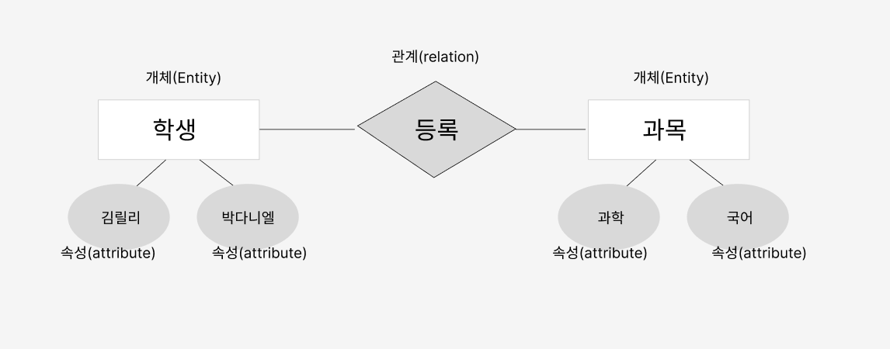

## 스키마?
- DB의 구조와 제약조건에 관한 전반적인 명세를 정의한 메타데이터의 집합

" 메타데이터"
- 데이터에 대한 데이터로, 어떤 목적을 가지고 만들어진 데이터

개체의 특성을 나타내는 속성과, 속성들의 집합으로 이루어진 개체, 개체사이에 존재하는 관계에 대한 정의와 이들이 유지해야할 제약조건을 기술한 것. 

### 스키마의 특징
- 데이터 사전에 저장된다 
- 특정 데이터 모델을 이용해서 만들어진다.
- 시간에 따라 불변인 특성을 가진다.
- 데이터의 구조적 특성을 의미하며, 인스턴스에 의해 규정된다.

### 스키마 3계층
1. 외부스키마(External Schema) = 사용자 뷰
- 개별 사용자들의 입장에서 데이터 베이스의 논리적 구조를 정의한 것
- 동일한 데이터에 대해, 서로 다른 관점을 정의할 수 있도록 허용
- 하나의 데이터 베이스 시스템에는 여러 개의 외부 스키마가 존재 가능하며, 하나의 외부 스키마를 여러 개의 응용 프로그램이나 사용자가 공유할 수도 있다.

2. 개념 스키마 (Conceptual Schema) = 전체적인 뷰
- 데이터 베이스의 전체 조직에 대한 논리적인 구조로, 물리적인 구현은 고려하지 않는다.
- 각 데이터 베이스에느느 한 개의 개념 스키마만 존재한다.
- 개체 간의 관계 및 무결성 제약 조건에 대한 명세를 정의 ( 데이터 베이스의 정확성, 일관성을 보장하기 위해 저장,삭제,추가등을 제약하기 위한 조건)
- 데이터 베이스 파일에 저장되는 데이터의 형태

3. 내부 스키마 (Internal Schema) = 저장 스키마
- 물리적 저장장치의 입장에서 본 데이터 베이스 구조
- 개념 스키마를 디스크 기억장치ㅔ 물리적으로 구현하기 위한 방법을 기술
- 저장될 데이터 항목의 내부 레코드 형식, 물리적 순서 등을 나타냄

### 데이터 독립성
- 데이터 베이스 내의 데이터 , 데이터를 사용하는 사용자 및 응용 프로그램, 데이터 베이스의 저장 구조가 서로 영향을 받지 않는 성질

#### 논리적 독립성 
- 개념 스키마가 변경되어도, 외부 스키마에 영향을 주지 않는다.

#### 물리적 독립성
- 내부 스키마가 변경되어도 개념 스키마/ 외부 스키마에 영향을 주지 않는다.
