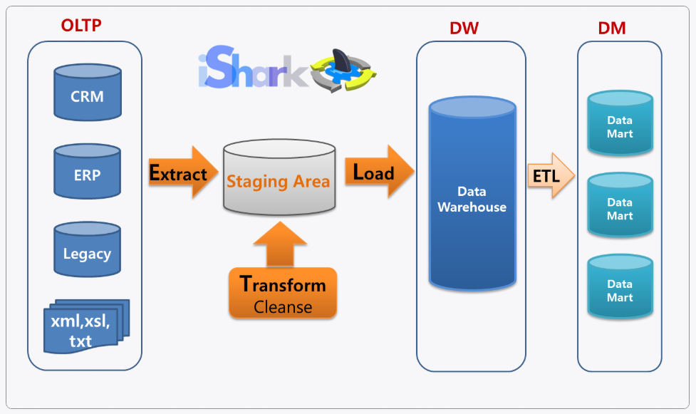

### 1. ETL

(1) ETL의 개념 및 특징
- ETL은 데이터의 이동 및 변환 절차와 관련한 업계 표준 용어이다.
- 다양한 데이터 원천으로 부터 데이터를 추출 및 변환해 운영 데이터스토어(ODS), 데이터 웨어하우스(DW), 데이터 마트(DM) 등에 데이터를 적재하는 작업이 핵심 구성요소이다.
- 데이터 이동과 변환을 주 목적으로 한다.
- 정기적인 실행 일정을 조정할 수 있는 재사용이 가능한 컴포넌트들로, 대용량 데이터를 처리하기 위한 MPP를 지원할 수 있다.
- ETL 구현을 위한 여러 상용 소프트웨어들이 있으며, batch ETL, RealTime ETL로 구분된다.

(2) 기능
- Extraction : 하나 또는 그 이상의 데이터 원천들로부터 데이터 획득
- Transformation : 데이터 클렌징, 형식 변환 및 표준화, 통합 또는 다수 애플리케이션에 내장된 비즈니스 툴 적용
- Load : 변형 단계의 처리가 완료된 데이터를 특정목표 시스템에 적재

(3) 작업 단계
-  Oracle, MY SQL, SQL Server, Excel -> ETL -> ODS 적재 -> ELT > de-normalizing -> 운영 보고서 작성, DW 적재 -> ETL -> DM 적재

1) step0 interface : 다양한 DBMS 및 스프레드시트 등 데이터 원천으로 부터 데이터를 획득하기 위한 인터페이스 메커니즘 구현

2) step1 staging : 수립된 일정에 따라 데이터 원천으로부터 트랜잭션 데이터 획득 작업 수행 후, 획득된 데이터를 스테이징 테이블에 저장

3) step2 profiling : 스테이징 테이블에서 데이터 특성을 식별하고 품질 측정

4) step3 cleansing  다양한 규칙들을 활용해 프로파일링된 데이터의 보정 작업을 수행

5) step4 integration : 데이터 충돌을 해소하고, 클렌징된 데이터를 통합

6) step5 denormalizing : 운영 보고서 생성 및 데이터 웨어하우스 또는 데이터 마트에 대한 데이터 적재를 위해 데이터 비정규화 수행

 