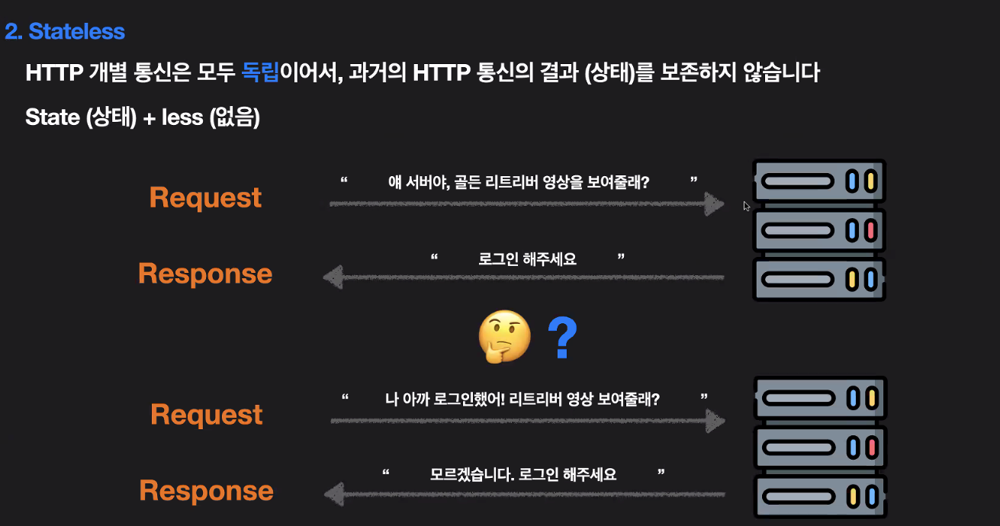

## HTTP

HTTP는 웹과 통신하기 위해 사용하는 방법으로 HTML 문서와 같은 리소스를 가져오는 약속이다.
어떻게 주고받을지에 대한 소통 방식과 약속을 뜻한다.
- hyper text : 문서와 문서가 링크로 연결됨
- Transfer : HTML로 만든 웹 페이지 문서를 보냄
- Protocol : 컴퓨터끼리 어떻게 HTML을 주고받을지 약속함.

### 1. stateless
- HTTP는 기억력이 좋지않다. 매 요청마다 정확하게 모든 정보를 말해줘야 그에 맞는 행동을 한다.
- HTTP 개별 통신은 모두 독립이라 과거의 통신 결과를 보존하지 않는 것을 stateless라고한다.
- 요청을 보낼 때 매번 처음의 정보를 저장해서 계속해서 던져줘야한다. (새로운 사람에게 얘기하듯이)

 

출처 : https://velog.io/@willy4202/HTTP%EB%A5%BC-%EB%A9%B4%EC%A0%91%EC%97%90%EC%84%9C-%EB%AC%BB%EB%8A%94%EB%8B%A4%EB%A9%B4

### 3. 상태코드

1) 성공
- 200 : OK
- 201 : Created - POST 요청에 따라 데이터 생성, 수정되었을 떄
- 204 : No content - 성공적으로 삭제되었을때

2) Client error 
- 400 : Bad Request  - 해당 요청이 잘못되었을 때, 주로 Body에 보내는 내용이 잘못되었을떄
- 401 : Unauthorized - 인증이 되지 않았을때, 예를 들어 로그인 되지 않은 상태에서 장바구니에 물건을 담았을 경우
- 403 : Forbidden - 해당 요청에 대한 접근 권한이 없다 (접근 불가능한 정보에 접근)
- 404 : Not Found  - 요청된 url이 존재하지 않는다는 의미를 나타낼때

3) Server error
- 500 : internal server Error - 서버에서 에러가 났을 때 발생