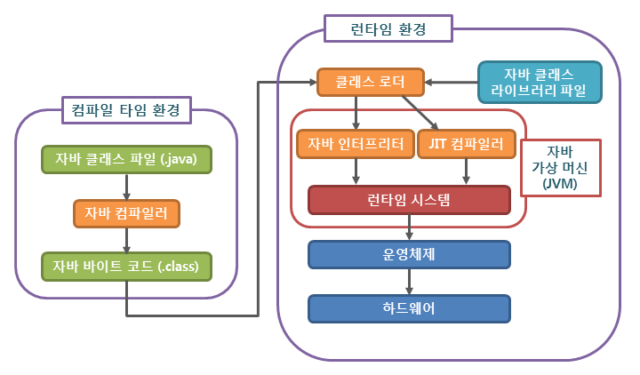

## 자바 프로그래밍
출처 : TCP School

### 자바 프로그램의 실행 과정

### 자바 컴파일러
- 자바 컴파일러는 자바 소스코드를 JVM이 이해할 수 있도록 바이트 코드로 변환한다.
- 자바 설치 시 javac.exe라는 실행파일 형태로 설치된다. 

### 자바 바이트 코드
- JVM이 이해할 수 있는 언어로 변환된 소스코드
- 컴파일러에 의해 변환되는 명령어 크기가 1바이트이기에 바이트 코드라고 불린다.
- 확장자는 .class 이다.
- JVM만 설치되어 있으면, 어떤 운영체제에서도 실행될 수 있다.

### 자바 가상 머신(JVM)
- Java Virtual Machine : 자바 바이트 코드를 실행시키기 위한 가상의 기계
- 자바로 작성된 모든 프로그램은 JVM에서만 실행될 수 있으므로 , 이것이 설치되어있어야한다.
- 서로 다른 운영체제라도 JVM이 설치되어 있다면 아무런 추가 조치 없이 같은 프로그램이 동작할 수 있다.
- 각 운영체제에 맞는 자바 가상머신을 설치해야한다.
- 실행속도가 상대적으로 느리다는 단점이 있다.

### JVM의 구성요소

1. 자바 인터프리터
- 자바 컴파일러에 의해 변환된 바이트 코드를 읽고 해독하는 역할

2. 클래스 로더
- 자바는 동적으로 클래스를 읽어오므로, 런타임에 모든 코드가 JVM과 연결된다.
- 동적으로 클래스를 로딩해주는 역할을 한다.

3. JIT 컴파일러
- Just-in-Time : 런타임에 실제 기계어로 변환해주는 컴파일러
- 동적 번역이라고 불리는 기법, 프로그램의 실행속도 향상을 위해 개발됨
- 자바 바이트 코드를 런타임에 바로 기계어로 변환함. 

4. 가비지 콜렉터
- 더는 사용하지 않는 메모리를 자동 회수

